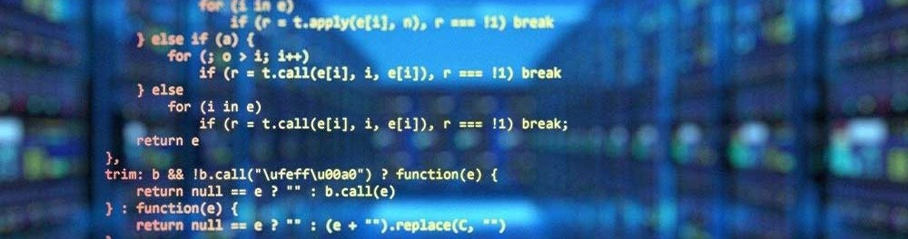
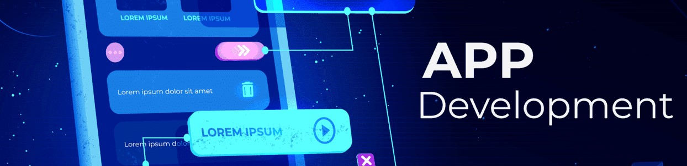
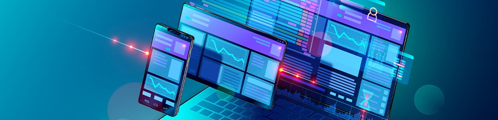
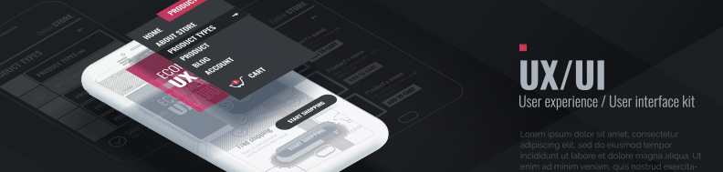

# Computer-Science-Tracks-Roadmaps (2023 / 2024)
This is a repository to present our roadmaps for different computer science tracks. We are following these roadmaps to prepare our volunteers to work in each track.

# **What is IEEE ManCSC?**

IEEE Mansoura Computer Society Chapter is a non-profit organization that **aims for:**
- Building a cooperative community that seeks to share knowledge in different fields of computer science.
- Developing a computer science society in Mansoura that tries to take the advanced and trending topics of different fields.
- Trying to serve a permanent content that helps the neighboring community.
- Help members to develop the skill of researching & explaining.
- Assist members in developing their technical skills in different computer science fields by working on efficient roadmaps.
- Preparing members to the professional atmosphere of the technology jobs market by giving  them the chance  to work under a structure and certain processes.

#
 > **IEEE ManCSC** is considered to be a technical subunit of IEEE Mansoura Student Branch, IEEE ManCSC follows the IEEE Computer Society which is the world’s leading organization of computing and information technology professionals with the computing community’s primary source for relevant and dependable data.
#

# **Computer Science Tracks in IEEE ManCSC**

- ## **Back-end**: [Roadmap for studying Back-end Tasks & Projects Node js ](https://github.com/saifsweelam/IEEE-Nodejs-Roadmap)
- ##  [Roadmap for studying Back-end Tasks & Projects Laravel](https://github.com/SalmaRedaBedair/IEEE_Tasks_Backend_commitee)
#

- ## **Data Science**: [Roadmap for studying Data Science with Tasks & Projects](https://github.com/Ahmed-Hereiz/Data-Science-Roadmap-IEEEManCSC-2024)
#

- ## **Embedded Systems**: [Roadmap for studying Embedded Systems with Tasks & Projects](https://github.com/AhmedAdelWafdy7/EMBEDDED-ROADMAP-IEEE)
#

- ## **Flutter**: [Roadmap for studying Flutter with Tasks & Projects](https://github.com/Maryam-Elgohary/Flutter-Roadmap)
#

- ## **Front-end**: [Roadmap for studying Front-end with Tasks & Projects](https://github.com/HunterXNB/Frontend-Roadmap)
#

- ## **UI / UX Design**: [Roadmap for studying UI / UX Design with Tasks & Projects](https://github.com/ahmedabdelati27/ui-ux-roadmap-IEEE)

- ## **[ Under Development ] Cyber Security - Web Penetration Testing**: [Roadmap for studying Web Penetration Testing with Tasks & Projects](https://github.com/ossamayasserr/WebAppPentestRoadmap)

- ## **[ Under Development ] Networking**: [Roadmap for studying Networking with Tasks & Projects](https://mohamedelweza.notion.site/RoadMap-Network-4db4036a130b49a18467eb3f63eaecf1?pvs=4)

#
# **Contacts**
- [csc.ieeemansb.org](csc.ieeemansb.org)
- [FaceBook](https://www.facebook.com/ieeemancsc)
- [LinkedIn](https://www.linkedin.com/company/ieeemancsc/)
- [YouTube](https://www.youtube.com/channel/UCqXBZM5eGl7fs1Vzwvlc8CQ)
- Gmail : ieeemancsc@gmail.com